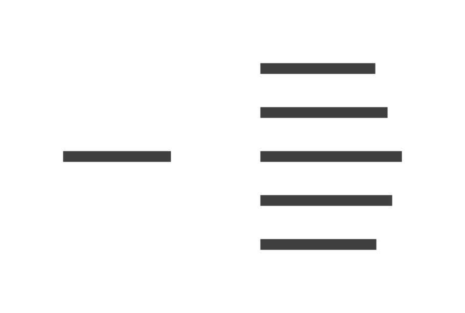

+++
Title = "Syntax deep dive"
Type = "book"

[menu]
  [menu.dotnet]
    Name = "Syntax deep dive"
    Parent = "Roslyn SDK"
+++

## Declarations



`MemberDeclarationSyntax` is derived by:
- `BaseFieldDeclarationSyntax`
- `BaseMethodDeclarationSyntax`
- `BaseNamespaceDeclarationSyntax`
- `BasePropertyDeclarationSyntax`
- `BaseTypeDeclarationSyntax`

All declarations have an `AttributeList` and `Modifiers`.

### Field declarations

```d2 layout=elk
direction: up
BaseFieldDeclarationSyntax -> MemberDeclarationSyntax
EventFieldDeclarationSyntax -> BaseFieldDeclarationSyntax
FieldDeclarationSyntax -> BaseFieldDeclarationSyntax
```

`BaseFieldDeclarationSyntax` is derived by:
- `EventFieldDeclarationSyntax`
- `FieldDeclarationSyntax`

All declarations have a `Declaration` with `SemicolonToken` trivia, in addition to `AttributeList` and `Modifiers`.

Event fields also have an `EventKeyword` trivia.

Field declarations have no additional attributes or trivia.

### Method declarations

```d2 layout=elk
direction: up
BaseMethodDeclarationSyntax -> MemberDeclarationSyntax
ConstructorDeclarationSyntax -> BaseMethodDeclarationSyntax
ConversionOperatorDeclarationSyntax -> BaseMethodDeclarationSyntax
DestructorDeclarationSyntax -> BaseMethodDeclarationSyntax
MethodDeclarationSyntax -> BaseMethodDeclarationSyntax
OperatorDeclarationSyntax -> BaseMethodDeclarationSyntax
```

`BaseMethodDeclarationSyntax` is derived by:
- `ConstructorDeclarationSyntax`
- `ConversionOperatorDeclarationSyntax`
- `DestructorDeclarationSyntax`
- `MethodDeclarationSyntax`
- `OperatorDeclarationSyntax`

All declarations have a `Body`, `ExpressionBody`, `ParameterList`, and a `SemicolonToken`, in addition to `AttributeList` and `Modifiers`.

Constructor declarations also have an `Identifier` and `Initializer`.

Conversion operator delcarations also have `CheckedKeyword`, `ExplicitInterfaceSpecifier`,  `ImplicitOrExplicitKeyword`, and `OperatorKeyword`.

Destructor declarations also have a `TildeToken` trivia.

Method declarations also have `ConstraintClauses`, `ExplicitInterfaceSpecifier`, `Identifier`, `ReturnType`, and `TypeParameterList`.

Operator declarations also have `CheckedKeyword`, `ExplicitInterfaceSpecifier`, `OperatorKeyword`, `OperatorToken`, and `ReturnType`.

### Namespace declarations

```d2 layout=elk
direction: up

BaseNamespaceDeclarationSyntax -> MemberDeclarationSyntax

FileScopedNamespaceDeclarationSyntax -> BaseNamespaceDeclarationSyntax
NamespaceDeclarationSyntax -> BaseNamespaceDeclarationSyntax
```

`BaseNamespaceDeclarationSyntax` is derived by:
- `FileScopedNamespaceDeclarationSyntax`
- `NamespaceDeclarationSyntax`

All declarations have `Externs`, `Members`, `Usings`, and `Name`, in addition to `AttributeList` and `Modifiers`, as well as `NamespaceKeyword` trivia.

File-scoped namespace declarations also have a `SemicolonToken` trivia.

Block namespace declarations also have a `CloseBraceToken`, `OpenBraceToken`, and `SemicolonToken` trivia.

### Property declarations

```d2 layout=elk
direction: up

BasePropertyDeclarationSyntax -> MemberDeclarationSyntax

EventDeclarationSyntax -> BasePropertyDeclarationSyntax
IndexerDeclarationSyntax -> BasePropertyDeclarationSyntax
PropertyDeclarationSyntax -> BasePropertyDeclarationSyntax
```

`BasePropertyDeclarationSyntax` is derived by:
- `EventDeclarationSyntax`
- `IndexerDeclarationSyntax`
- `PropertyDeclarationSyntax`

All declarations have an `AccessorList`, `ExplicitInterfaceSpecifier`, and `Type` in addition to `AttributeList` and `Modifiers`.

Event declarations have an `EventKeyword`, `Identifier`, and `SemiColonToken`.

Indexer declarations have an `ExpressionBody`, `ParameterList`, as well as `Semicolon`, `SemicolonToken`, and `ThisKeyword` trivia.

Property declarations have an `ExpressionBody`, `Identifier`, and `Initializer`, as well as `Semicolon` and `SemicolonToken` trivia.

### Type declarations

```d2 layout=elk
direction: up

BaseTypeDeclarationSyntax -> MemberDeclarationSyntax

EnumDeclarationSyntax -> BaseTypeDeclarationSyntax
TypeDeclarationSyntax -> BaseTypeDeclarationSyntax

ClassDeclarationSyntax -> TypeDeclarationSyntax
InterfaceDeclarationSyntax -> TypeDeclarationSyntax
RecordDeclarationSyntax -> TypeDeclarationSyntax
StructDeclarationSyntax -> TypeDeclarationSyntax
```

`BaseTypeDeclarationSyntax` is derived by:
- `EnumDeclarationSyntax`
- `TypeDeclarationSyntax` which is further derived by:
  - `ClassDeclarationSyntax`
  - `InterfaceDeclarationSyntax`
  - `RecordDeclarationSyntax`
  - `StructDeclarationSyntax`

All declarations have a `BaseList` and `Identifier` in addition to `AttributeList` and `Modifiers`.

Other trivia include `CloseBraceToken`, `OpenBraceToken`, and `SemicolonToken`.

Enum declarations include `EnumKeyword` and `Members`.

Type declarations include `ConstraintClauses`, `Keyword`, `Members`, `ParameterList`, `TypeParameterList`.

| Property          | Enum               | Class              | Interface          | Record             | Struct             |
| ----------------- | ------------------ | ------------------ | ------------------ | ------------------ | ------------------ |
| AttributeList     | :white_check_mark: | :white_check_mark: | :white_check_mark: | :white_check_mark: | :white_check_mark: |
| BaseList          | :white_check_mark: | :white_check_mark: | :white_check_mark: | :white_check_mark: | :white_check_mark: |
| ConstraintClauses | :x:                | :white_check_mark: | :white_check_mark: | :white_check_mark: | :white_check_mark: |
| Identifier        | :white_check_mark: | :white_check_mark: | :white_check_mark: | :white_check_mark: | :white_check_mark: |
| Members           | :white_check_mark: | :white_check_mark: | :white_check_mark: | :white_check_mark: | :white_check_mark: |
| Modifiers         | :white_check_mark: | :white_check_mark: | :white_check_mark: | :white_check_mark: | :white_check_mark: |
| ParameterList     | :x:                | :white_check_mark: | :white_check_mark: | :white_check_mark: | :white_check_mark: |
| TypeParameterList | :x:                | :white_check_mark: | :white_check_mark: | :white_check_mark: | :white_check_mark: |


While each declaration kind supports modifiers, the set of modifiers may be different. The below table shows the valid modifiers according to the C# language specification.

| Modifier    | Enum               | Class              | Interface          | Record             | Struct             |
| ----------- | ------------------ | ------------------ | ------------------ | ------------------ | ------------------ |
| `new`       | :white_check_mark: | :white_check_mark: | :white_check_mark: | :white_check_mark: | :white_check_mark: |
| `public`    | :white_check_mark: | :white_check_mark: | :white_check_mark: | :white_check_mark: | :white_check_mark: |
| `protected` | :white_check_mark: | :white_check_mark: | :white_check_mark: | :white_check_mark: | :white_check_mark: |
| `internal`  | :white_check_mark: | :white_check_mark: | :white_check_mark: | :white_check_mark: | :white_check_mark: |
| `private`   | :white_check_mark: | :white_check_mark: | :white_check_mark: | :white_check_mark: | :white_check_mark: |
| `readonly`  | :x:                | :x:                | :x:                | :x:                | :white_check_mark: |
| `ref`       | :x:                | :x:                | :x:                | :x:                | :white_check_mark: |
| `abstract`  | :x:                | :white_check_mark: | :x:                | :white_check_mark: | :x:                |
| `sealed`    | :x:                | :white_check_mark: | :x:                | :white_check_mark: | :x:                |
| `static`    | :x:                | :white_check_mark: | :x:                | :white_check_mark: | :x:                |
| `unsafe`    | :x:                | :white_check_mark: | :white_check_mark: | :white_check_mark: | :white_check_mark: |
| `partial`   | :x:                | :white_check_mark: | :white_check_mark: | :white_check_mark: | :white_check_mark: |
| `struct`    | :x:                | :x:                | :x:                | :white_check_mark: | :x:                |
| `class`     | :x:                | :x:                | :x:                | :white_check_mark: | :x:                |
