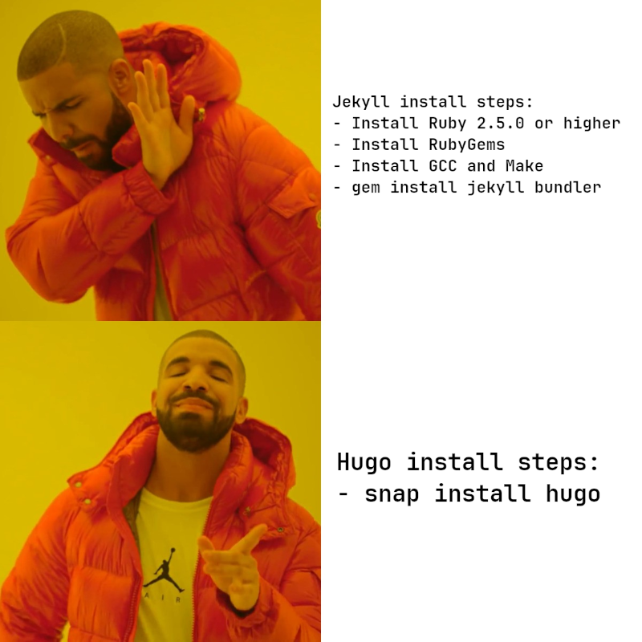

+++
Title = "Building the blog"
Date = '2023-11-12'
Summary = """
How exactly did I create this blog? In this post, I go over the process, the technologies used, and what's still left for me to build.
"""
+++

{}

## Motivations

Once I had decided I wanted to start writing again, the next question was: where? For my research activities, I had used a mixture of simply using a [text editor](https://kate-editor.org/), markdown files in [Visual Studio Code](https://code.visualstudio.com/), and [Notesnook](https://notesnook.com/). All of these were fine for what they were but I wanted something a little more...

- **Text files**: Great for writing short notes with minimal structure and need for formatting or styling. I typically used these for my "raw" notes that would later get turned into something else.
- **Notesnook**: I've been on the hunt for a good OneNote replacement. How and why I arrived on Notesnook is a completely different post on its own. This is where I stick all my notes and thoughts that I want synced across my devices. Things like my TODO's, my shopping lists, and my "internal" documentation.
- **MD in VS Code**: This was my gateway to full-on blogging. I like that I can easily add markup to my documents. I could also version these notes using Git. Depending on the plugins installed, I could even add support for more complex markup like embedding [D2 diagrams](https://d2lang.com/) directly. What I missed was two things: A site structure like a table of contents and being able to fully control the look and feel (i.e. the theme) of the pages that were being rendered.

It was my research into .NET Source Generators that finally pushed me over the edge to come up with a better solution. There are a few good sources of information on source generators out here, but none were as comprehensive as I'd have liked. And in general, I find Microsoft's own official documentation on the Roslyn SDK and packages woefully lacking. There is enough content here that I could probably write an ebook. So that's literally what I have started to do.

## Requirements

I knew from the get-go and from previous false starts that I had a set of must-have requirements:

- Must work with GitHub Pages, my intended host for all of this.
- Must use a nice markup language like Markdown, ASCIIDoc, or reStructuredText.
- Must be easy to install - and not require a ton of dependencies.
- Support diagramming (ideally with D2) out of the box, or through easy plugin support.
- Support long-form content like documentation and books through the availability of table of contents features.
- Allows for very detailed customization.

Essentially, the core of this project would come down to picking a static site generator. A static site generator is a tool that takes your markup, runs it through a renderer, and outputs some other format (like HTML). This is in contrast to a content management system like WordPress which pulls content from a database.

Since I knew I was going to treat a lot of the content as "documentation as code", integration with Git - and specifically GitHub as the host - meant that I should probably start there. The [GitHub Pages](https://docs.github.com/en/pages/getting-started-with-github-pages/about-github-pages#static-site-generators) documentation explicitly calls out Jekyll as their generator of choice. I quickly realized that Jekyll did not meet all of my requirements.

Jekyll is a fine static site generator, but it has a lot of prerequisites (for me). I wanted to do my best to avoid something that required system-wide installation of a tech stack that I would not otherwise use. With Jekyll, it was Ruby. No offense to the Ruby fans out there... I just don't use it.

A quick web search turned up some other alternatives. Eventually I settled on Hugo.

## The tech stack

So that took care of my core needs:

- **Host:** GitHub Pages
- **Site generator:** Hugo

Now for the rest. These were mostly picked based on my previous experience and what I was comfortable with:

- **Theme:** Custom built using Hugo's templating system.
- **Javascript framework:** None! I want this site as simple as possible.
- **CSS framework:** TailwindCSS. I consider this more a "library" than a framework. And that's what I tend to prefer. I know TailwindCSS vs other frameworks like Bootstrap can be a contentious topic - but for such a simple site like this, built around templates and components, I think it actually plays to its strengths.

I like minimal designs. And this is about as minimal as it gets!

## Building the template

Part of the reason I like minimal designs is that I'm terrible at designing UI in the first place. So the fewer things I need to style, the better!

And like with most designs, I look for inspiration elsewhere. I try not to blatantly "steal" someone else's design... but prefer finding two or more and creating mashup. Take the best elements of each and leave out the rest.

To give credit where credit is due, I used the two following sites as inspiration:

- [Adritian Free Hugo Theme](https://themes.gohugo.io/themes/adritian-free-hugo-theme/) - I loved the minimalist look to this person's design. It also fit the same personal-blog niche that I was looking for quite well.
- [TailwindUI Spotlight Template](https://tailwindui.com/templates/spotlight) - I also took a lot of inspiration from one of Tailwind's own templates for a personal website. And although I do own a license for TailwindUI, I ended up crafting the elements myself even where they do look the same.

Lastly, to absolutely no surprise of anyone (at least in the year this post was written), I used ChatGPT for some extra guidance as well. Specifically, I used GPT-4's vision capabilities to give it examples of what I was looking for and have it give me back the HTML and CSS that would produce something similar. Amazingly, it did a pretty good job. It didn't clone my examples perfectly, which was actually a feature. It helped bring a distinct look rather than being direct copies of the example elements.

## Creating the theme and scaffolding

When I am creating a theme or template for a website, I always start with simply writing some HTML. I just use Visual Studio Code for this and render it in the browser as I go along. Once I've created the full page layout (or a set of the standard page layout types), I set them aside and then jump into the framework that I will be implementing in. In this case, that meant Hugo's templating system. Since I've never used Hugo before, I took a pause here and jumped into their docs.

After following Hugo's [Getting started](https://gohugo.io/getting-started/) guides, I had a general sense for how things worked. Hugo is remarkably simple to use. I'm sure with some scripting and further customization I can make it even more simple. But that's future Greg's problem.

There are three main concepts that you need to learn when designing a Hugo site from the ground up:

- Configuration: How to tell Hugo what your site is about and what features and plugins you wish to use.
- Content management: How your source files will be laid out. What constitutes a single page / section / list, etc.
- Templates and layouts: How Hugo resolves the page type to a particular HTML layout. Themes generally provide most or all of this for you - giving you extension points where needed. Since I am not using a theme - all of the layouts had to be built ahead of time.

Since I knew I was going very minimal - I downloaded the [mini](https://themes.gohugo.io/themes/hugo-theme-cactus-plus/) Hugo theme to really understand how things fit together.

Rather than go into the details of how to build a Hugo theme here, I will create a more technical "how-to" series in the "books" section of my site.

Suffice to say, between looking at an example and looking at Hugo's excellent documentation, it is not too hard to do for yourself.

## Hosting

Once I had my theme put together and some starter content, it was time to publish to my host. In this case, GitHub pages. GitHub pages is remarkably simple to use - which is one reason I found it so compelling. I simply pushed my repository with the Hugo project and content. I added a new GitHub workflow (also documented on Hugo's website) to run the actual publish action when I push to the repo. And I made sure that GitHub knew to pull from the 'main'. That was it.

GitHub Pages also supports custom domains. GitHub's documentation, like Hugo's, is quite thorough. All it took was adding a few `A` records for IPV4, and `AAAA` records for IPV6 (because, why not?) and my domain was pointing to GitHub. Then, for good measure, I added the recommended `CNAME` record for the `www` subdomain. I added the expected custom domain in the GitHub settings, submitted, and well - here we are!

## What's left?

I've got mostly everything in place. Content aside, there are a few things still left to work on:

- Verify this template works on mobile devices and fix any issues that arise. For example (at the time of writing) the main website nav bar does not collapse on small screen sizes and it should. Headers need different paddings, etc.
- Discover the full capabilities of a page's front matter attributes.
- Make sure pagination is working properly on my list pages.
- Tags and taxonomy. Hugo has a powerful categorization system. Once I start writing more and about a wider variety of topics, this seems like it will be important for navigation.
- Experiment with the Table of Contents features for the more structured content that I plan to write. It looks like it supports intra-page navigation, but what about a ToC that spans multiple pages?
- Refactor the layout files so that I'm not duplicating HTML and so that I'm using the fewest amount of templates. Hugo has a rather lengthy lookup process for templates based on page kind and types, and so I want to make sure each layout is covering the widest area.
- Try my best to make the rendered HTML pretty. Can I make it look as if it weren't constructed from a bunch of partials? My OCD would like me to try.
- Tooling. Can I either use Hugo's CLI, or create my own, to make writing new posts and content even easier?

## Conclusions

Overall, this took me 3-4 evenings to throw together. Hugo has a few things that require some thorough reading, but it's otherwise not that hard to understand. GitHub pages is even easier. I think, at least for now, this will be the tech stack I'll be using for blogging. Unless I hit a wall with adding a particular feature, this feels pretty good to use. Now, let's use it!

I will update this post with links to my "how-to" series on setting up a similar setup to what I did.