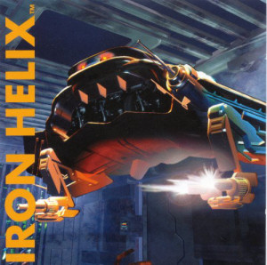
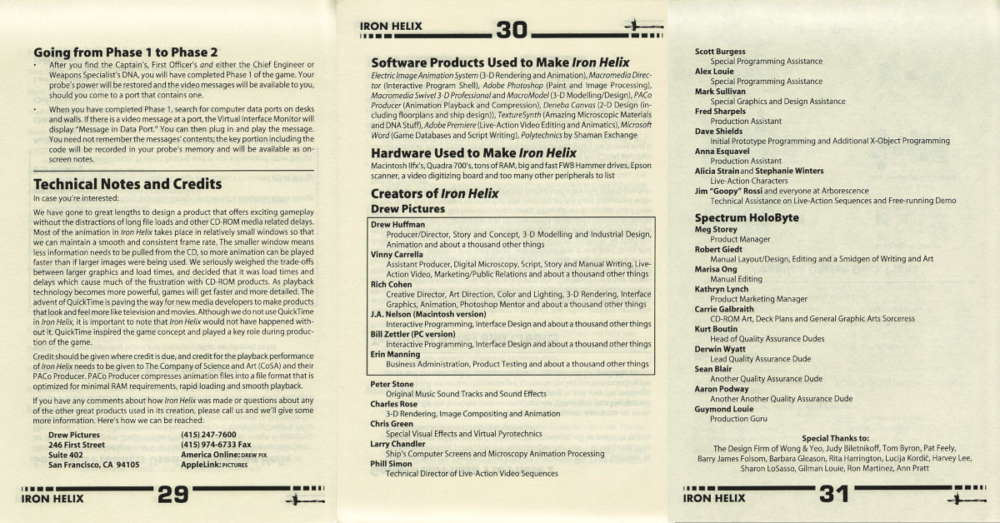

+++
title = "Iron Helix: A thirty year obsession"
date = '2024-04-14'
draft = false
categories = ['Retro','Personal story','Software','Video games']
+++

Most computer nerds like me probably have at least one or two key moments in their personal history of computing that have made a lasting mark. That could be the first time getting a BASIC program to run or the first time experiencing the Internet or its precursors. For others, it could be a particular machine or software for it.

For me, one of those moments was discovering the 1993 Drew Pictures video game _Iron Helix_. This game, this experience, was life changing for me. It set in motion a series of events that influenced me into the person I am today; its influence intertwined into the formative years of my youth.
<!--more-->

## Iron Helix

[Iron Helix](https://en.wikipedia.org/wiki/Iron_Helix) was released in 1993 for Windows and Macintosh, later being ported to Sega CD. Developed by a small game studio called Drew Pictures, the game was one of the earliest CD-ROM titles.

Set far into the future, the Earth destroyer _Jeremiah O'Brien_ is engaged in fleet battle exercises. The ship, capable of destroying an entire planet with a biological weapon of mass destruction known as the "Iron Helix" breaks away from the group going rouge. The onboard computer has malfunctioned mistaking a real-life target for the uninhabited planet used during the exercise.

The crew are desperate to regain control of the ship and prevent it from igniting a cold-war into a full conflict. Except they can't. An unknown contagion has infected the crew, mutating their DNA and locking them out of the ships systems. The ship's security mechanism - the "defender" robot - soon deploys and begins systematically killing off the crew, mistaking them for intruders. Coincidence? Or deliberate sabotage?

In a last ditch effort to stop the ship, the crew do what they can to embed computer programs, glitches, and other tools in the less-secured parts of the computer system in the hope that someone can board the ship and stop it.

A general distress call is sent out to all nearby ships capable of intercepting the _O'Brien_. You, the player, happen to be aboard a nearby science vessel and are recruited by Admiral Arboc to attempt the mission to stop the ship. Since it's dangerous to board the ship yourself, you send one of your three unarmed science drones. Capable of sampling DNA and interfacing with computers - you try to collect and resynthesize enough of the original crew's DNA to gain access to the ship's systems. In combination with the messages and glitches left behind by the crew before they died, you try to destroy the ship while simultaneously playing a game of cat and mouse with the ship's defender robot. There's often just enough time to get in and get out - and should you enter the line of sight of the defender robot - you're vaporized.

## Reception

At the time, _Iron Helix_ was fairly well received. It was fast paced for the time. While you had time to explore the ghost ship, there was always the looming threat of being offed by the defender. So despite never really directly interacting with anyone or anything else, the suspense was definitely there. Hearing the danger-level ping of your proximity sensor definitely got your adrenaline going.

_Iron Helix_ had incredibly realistic graphics compared to other contemporary titles. Even by today's standards, the graphics are pretty detailed - albeit viewed in a postage stamp sized window. The trick of seeing the high quality visuals through a mock remote control interface was a clever way of allowing for such detailed visuals to exist in a much smaller and more CPU friendly way.

While there were three different levels of difficulty to the game - once you have mastered all three, there was not much replay value. At least not for most people. The necessary DNA and clues were always in the same places, and while you could try out alternate means of trapping or destroying the defender and for destroying the ship, the end result was the same.

But for me personally - at the time - it was a fun, challenging game. I was fascinated by being able to explore the ship and unlocking previously inaccessible areas. It took me a few years of growing up until I was able to finally beat the game on the highest difficulty. I was then able to unlock the "cryogenics room" - an area only accessible at that difficulty - an area I had been eagerly anticipating.

## Why is this game so important to me?

On the surface, _Iron Helix_ seems like any other above-average game of the early 90's. Fun, novel for its time, and interesting to revisit every now and again. But why, out of all the other games from that time, am I so obsessed with this one?

### My Uncle Tom

I was about 8 years old when this game came out. This was a big year in my life. It's when my parents got divorced. It's when my still current struggles with stress and anxiety took root. It's also when I started to learn how computers worked and how to make them do things (i.e. programming).

That's where my Uncle Tom came in. My Dad was an early adopter of things. He always liked buying the latest and coolest gadgets to have and to show off. I was extremely privileged in this regard, as it afforded me very early access to things like computers and the Internet. But it was my Uncle Tom - who was in IT and Engineering - who showed me that these computers were not magical black boxes, that it was actually possible to peer beneath the covers and understand how they work.

I idolized him in my youth. I knew I was a builder from very early on. And I knew I wanted to know everything about computers. He recognized my potential and did what he could to help foster this curiosity.

My uncle gave me this game. If I remember correctly, it likely came with one of his newer computers bundled with the CD-ROM. At first, I played it when I visited their house. Eventually, he (or my parents after noticing my obsession) simply gave me the game outright.

### Looking behind the curtain

Fast forward another year or two and I am getting better at reading comprehension. Enough to start to understand technical writing. I'd already been playing this game over and over, but I soon turned to the things that accompanied the game: the manual.

In addition to simply explaining how to play the game and providing some more of the backstory, the manual included three pages that utterly fascinated me as a kid obsessed with how things worked: a "Technical Notes" and Credits page. Included were the names of all the people that worked on the game and what the role(s) they played. But even more fascinating to me was that they listed all of the software and hardware that they used to make the game.

My mind was blown. Up until then, I had only really been exposed to QBasic on MS-DOS. I could make simple things - mostly text based. So to now see "what it takes" to build my favorite game? My mind was opened up even further and my curiosity taken to the next level.

Most of the software were things I had never heard of. Nowadays - there are a few that are quite recognizable: Adobe Photoshop, Adobe Premiere, and Adobe (nee Macromedia nee Macromind) Director. But there were others. Ones that I still don't know much about. Electric Image Animation System, Deneba Canvas, TextureSynth, Polytechnics, and PACo Producer, for example.

I tried to find out what I could about these software. But given my limited resources back then and the nascent Google-less internet, details were not easy to come by. And by the time the "modern" internet began to take shape, some of the software had already started receding into obscurity, never having made a lasting impression.

But there was one final, amazing, piece of information on those pages...

### Contacting Drew Pictures

Drew Pictures _published their contact information_ in the form of a mailing address and their office phone number.

My mother, likely tempering my obsession, but still encouraging me - helped me write a letter to them. Fan mail. I had done things like this before. At that time, who knows if my parents ever actually sent them. I was a little kid after all. My attention span would probably have forgotten about the letter the next week anyways.

But one day the phone rang. My mother picked up and was surprised. On the phone was [Vinny Carrella](https://www.linkedin.com/in/vincentcarrella/) - the assistant producer and writer of _Iron Helix_. I don't think I had caught on what had just happened. If my memory serves me correctly (keep in mind, I'm about 9 or 10 now?) she had a short conversation with him probably making sure he was prepared to talk to a 4th grader.

I'll never forget. One day that conversation did happen. I was talking to one of the key people responsible for creating my favorite game of all time. While the details of the conversation are fuzzy, I remember Vinny introducing himself to me. He told me a little about how he contributed to _Iron Helix_ - and how the company was no longer called Drew Pictures. They had been renamed or bought out and were now going by the name of "Pulse Entertainment". I had asked if they were planning on a follow-up to Iron Helix - a sequel. And while he didn't dismiss the idea, he told me about a new game they were working on. A bizarre sounding game where the player was a cockroach... called "[Bad Mojo](https://en.wikipedia.org/wiki/Bad_Mojo)".

The call was such an incredible gesture by Vinny and the team. Sure, he was also acting as the studio's PR guy - but he didn't have to take the time to call some random kid from Pennsylvania. I think we had maybe talked once more over the phone before I had probably overstayed my welcome and called the office one too many times. I _was_ obsessed, after all. My mom had to gently explain "enough is enough" and that they're probably very busy. I'm sure I felt disappointed at the time, but even back then, deep down I understood. Just the short conversation or two we had made such a deep and lasting impression on me.

Vincent - if you ever happen upon this post - hit me up on LinkedIn or email (greg at gregdom). I'd love to take you to lunch or dinner. Your choice of venue, my treat. I would love to hear what you've been up to.

## Lasting impressions

Over 30 years later, this game still occupies my mind space. For one, it was a good memory from an otherwise very difficult year for me. But more than that, it threw even more fuel on my _confidence_ that I _could_ learn how these computer things worked.

It provided me with a goal. I've been given clues, just like in the game, left by the _real_ crew on how to replicate a game like this. While I was still too young and did not have the experience to fully comprehend how to get there, it did help steer me by motivating me to see what I _could_ replicate. It gave me inspiration on projects to build using the tools that I did have. Could I replicate the computer menu system through basic? Yup. Could I record my own sound files and play them back? Kind of. When I graduated to Visual Basic - did I attempt to draw my own graphics and create a steerable on-rails game? You bet. It was awful! But it pushed me to continue to learn. And did so in the best way: to achieve a real set of goals.

In a way, my programming career was started by and grew up with this game. Sure, there were other contributors along the way. But this game and my programming skills are now about 30 years old.

And now I _do_ understand and comprehend how they made the game. In fact, my computer skills have far surpassed what would have been required to build a game like this. (Of course, I lack other skills like graphics, sound, and music design, etc.) I've started converting all of the game's files over to modern formats that can be viewed using today's software. Most formats are pretty easy - WAV files, raw bitmaps, etc. But one is still eluding me: The PACo format used by all of the game's FMV and animation sequences. This format was short lived, even by computer standards. As far as I can tell, there is no modern software that still supports this format.

So I've started reverse engineering it :grin:. But that's a story for another time.

## What's next

What do you get when you combine a materialistic person with a nostalgic person? You get a hoard...er... I mean a "collector". Digital preservation has become an incredibly interesting problem for me. This is also a story for another time. But in the context of this game....

I now own a Macintosh IIfx and Quadra 700 which were the computers used by the team. (Not the exact ones, but still.)

I've been able to find copies of many of the software used.

I've just now found a copy of _CoSA_ After Effects that might be able to actually import PACo files! So I may now finally have the necessary pieces of the puzzle to read all of the individual files of the game. Sweet :smile:.

Having achieved that goal, I could theoretically recreate the shell of the game using more modern technology. I could upscale (to a degree) the graphics and videos too. I could finally re-create the game.

But I really don't want to stop there.

This game is so important to me, I do want to try to do more. I would love to be given the opportunity to help preserve it. I want to find the original source. The original uncompressed video, graphics, sound files, etc. I'd love any notes, sketches, scripts, concept artwork. I have no clue if it even still exists, but I'm hopeful. Once of these days, I may reach out to Vincent again.

Peter Stone (a.k.a [Xorcist](http://xorcist.com/)) has posted original CD quality releases of much of the Iron Helix music on his website. He's also [posted a video](https://www.youtube.com/watch?v=ScJUzgfN1cE) of him actually recording the music to the opening title sequence of _Iron Helix_ on YouTube! So cool.

Drew Pictures, now Pulse Entertainment's _Bad Mojo_ was given a remake in 2004. It also included a DVD full of behind the scenes material and interviews. So - perhaps the same could be done for Iron Helix?

It's hard to know where the IP for this game ended up. Legally, it could have followed Spectrum Holobyte through their various acquisitions. But the source? That could be in someone's garage or attic for all I know. And if that is the case, I want to make sure that any of the floppies, hard drives, tapes, and/or CDs are preserved.

Why? Because it deserves to be. Just like all games and software and hardware from the past. And because this game was so special to me. I would be honored by the privilege. I grew up with this game. It helped shape who I am today. It feels almost fitting that I return the favor and help keep it alive.